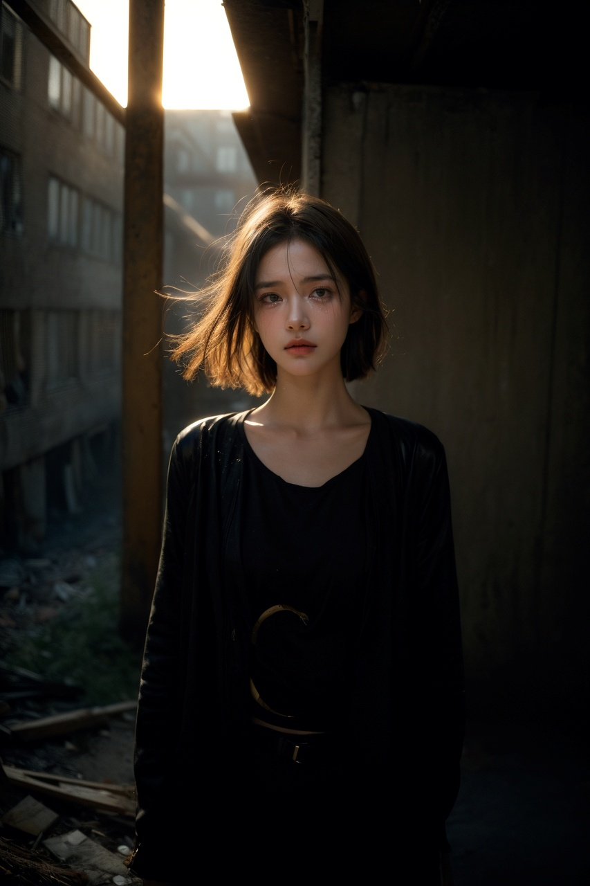
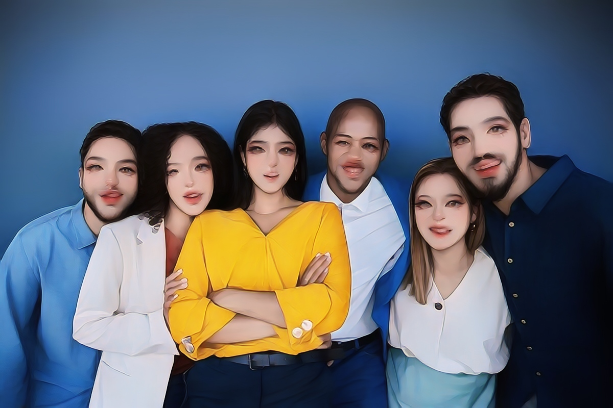
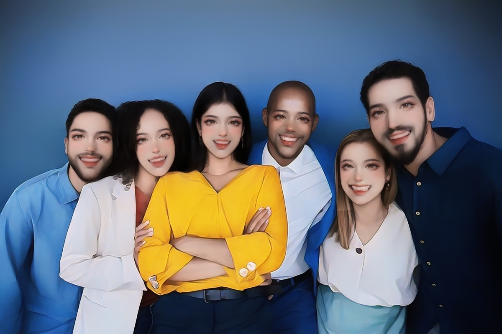
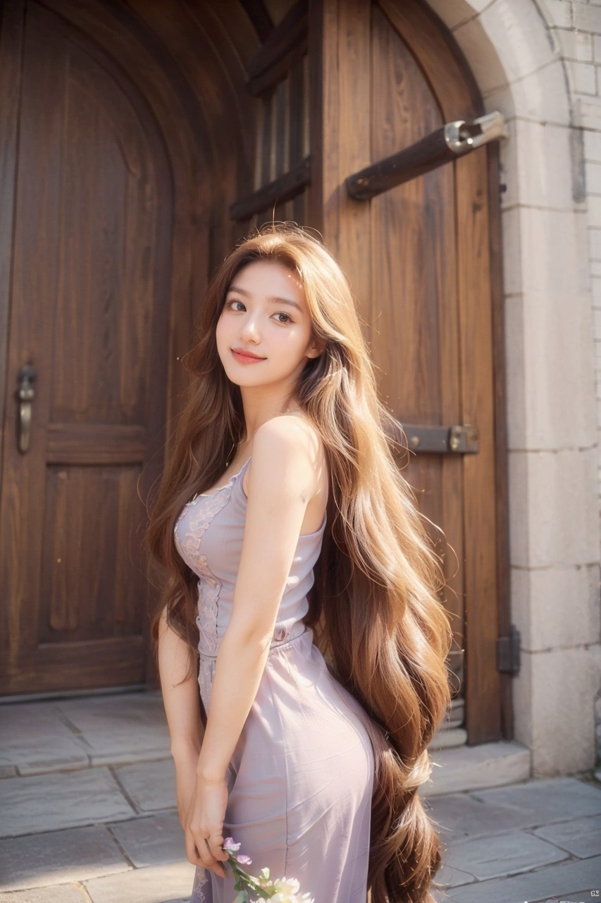
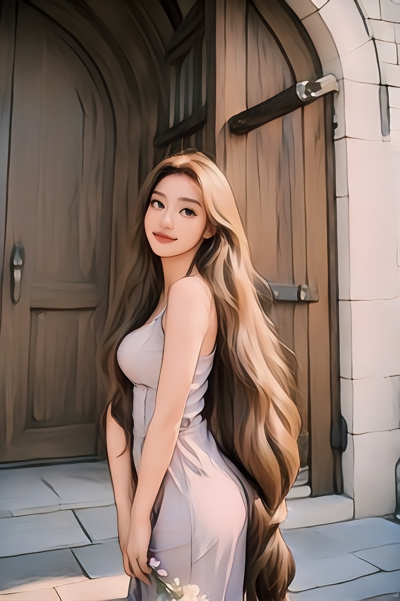
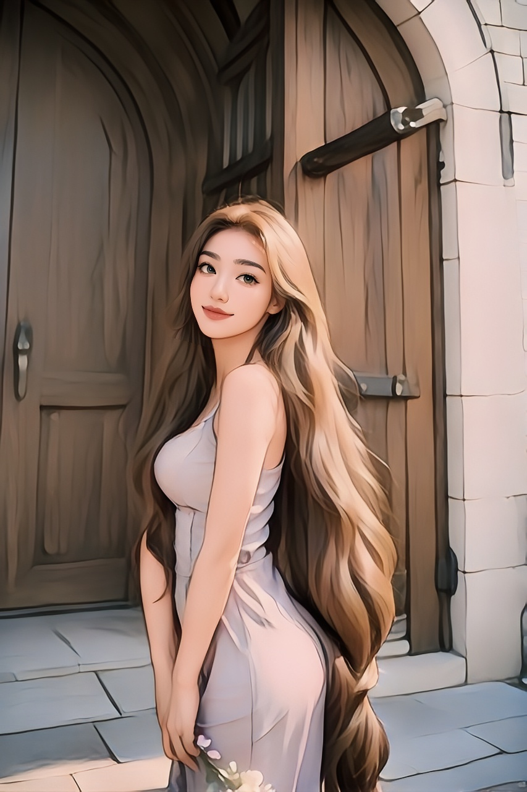

# AnimeGANv3 Portrait Inference 


## Introduction
1. AnimeGANv3's portrait style model focuses more on the stylized transformation of the face area. Such as Kpop, USA, Disney, Trump, Nordic_myth2 and Arcane.
2. This repo mainly deals with situations where multiple faces appear in images or videos.
3. The program uses face detection to detect each face in the image and then transforms it separately, and then uses the homography matrix and head segmentation to restore the transformed faces to the original image. 
4. Since portrait style models are mainly trained using close-up face images, it may not be applicable when the face area in the image is particularly small or blurry.
5. If used for inference video, ffmpeg should be installed.  

## Usage  

### 1. Install Dependencies  
   ```bash
   pip install -r requirements.txt
   ```

### 2. Batch inference on images
#### 1. For a single image.
  ```bash
  python onnx_infer.py -i data/sample/1.jpg -m ../deploy/models/AnimeGANv3_large_Kpop.onnx -o ./out --background
  ```

#### 2. For Multiple images.  
 ```bash
  python onnx_infer.py -i data/sample -m ../deploy/models/AnimeGANv3_large_Kpop.onnx -o ./out --background
  ```

##### 🔸 Parameter Description
- -i , The location of the input image or the directory where the images are located
- -m , The path where the onnx model of AnimeGANv3 is located
- -o , The directory location where the conversion results are saved
- --background , Whether to perform stylization on the background area other than the face
- --save_croped , Whether to save the detected faces and converted face images in each picture.

 

### 3. Inference on video
```bash
  export CUDA_VISIBLE_DEVICES=0 && python onnx_infer.py -i ../1.mp4 -m ../deploy/models/AnimeGANv3_large_Kpop.onnx -o ./out --background --IfConcat Horizontal 
```
##### 🔸 Parameter Description
- -i , The location of the input video
- -m , The path where the onnx model of AnimeGANv3 is located
- -o , The directory location where the conversion results are saved
- --background , Whether to perform stylization on the background area other than the face
- --IfConcat , Whether to splice the original video with the converted video. ["None", "Horizontal", "Vertical"] 

## Comparison  

#### 👀 The results shown in the table below demonstrate the difference in the final effects of the two inference methods.
◼️ The script [test_by_onnx.py](https://github.com/TachibanaYoshino/AnimeGANv3/blob/master/deploy/test_by_onnx.py) provided by AnimeGANv3 simply performs a single inference on the entire image. Its inference speed is faster, but the effect on the face may not be perfect.  <br>
◼️ This library can process the face and background in the image separately, so as to obtain better conversion effect.

| Input photo | <a href="https://github.com/TachibanaYoshino/AnimeGANv3/blob/master/deploy/test_by_onnx.py">test_by_onnx.py</a> | onnx_infer.py | Style |
| :-: |:-:| :-:| :-: |
|||| <a href="https://github.com/TachibanaYoshino/AnimeGANv3#art-face-to-arcane-style">Arcane</a> |
||||   <a href="https://github.com/TachibanaYoshino/AnimeGANv3#art-face-to-kpop-style">Kpop</a> |
||||     <a href="https://github.com/TachibanaYoshino/AnimeGANv3#art-face-to-usa-cartoon-style">USA</a> |
    
