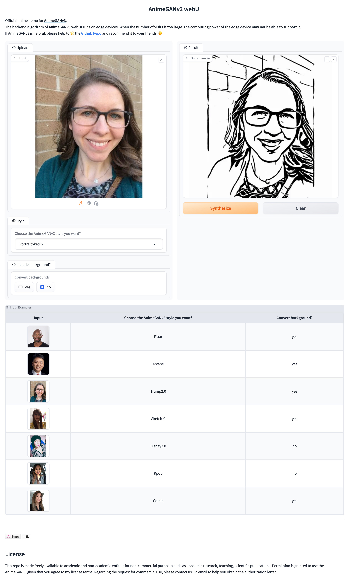

# AnimeGANv3 Portrait Inference by tensorRT


## Introduction
1. AnimeGANv3's portrait style model focuses more on the stylized transformation of the face area. Such as Kpop, USA, Disney, Trump, Nordic_myth2 and Arcane.
2. This repo mainly deals with situations where multiple faces appear in images or videos.
3. The program uses face detection to detect each face in the image and then transforms it separately, and then uses the homography matrix and head segmentation to restore the transformed faces to the original image.
4. Since portrait style models are mainly trained using close-up face images, it may not be applicable when the face area in the image is particularly small or blurry.
5. If used for inference video, ffmpeg should be installed.

## Usage  

### 1. Install Dependencies  
   - install [TensorRT-8.6.1](https://docs.nvidia.com/deeplearning/tensorrt/archives/tensorrt-861/install-guide/index.html#installing-tar)
   - run the pip command
   ```bash
   pip install -r requirements.txt
   ```

### 2. Model conversion  

Use the script files in **scripts** to convert the onnx models of retianface, parsenet, and AnimeGANv3 to tensorRT models. 
- Modify the script parameters and then perform the conversion.

### 3. Batch inference on images
#### 1. For a single image.
  ```bash
  python convert.py -i data/sample/1.jpg  -o ./out -s PortraitSketch --background
  ```

#### 2. For Multiple images.  
 ```bash
  python convert.py -i data/sample  -o ./out -s PortraitSketch --background
  ```

##### 🔸 Parameter Description
- -i , The location of the input image or the directory where the images are located
- -o , The directory location where the conversion results are saved
- -s , Select the AnimeGANv3 style you want to convert
- --background , Whether to perform stylization on the background area other than the face
- --save_croped , Whether to save the detected faces and converted face images in each picture.

 

### 4. Inference on video
```bash
  export CUDA_VISIBLE_DEVICES=0 && python convert.py -i ./1.mp4  -o ./out -s USA --background --IfConcat Horizontal 
```
##### 🔸 Parameter Description
- -i , The location of the input video
- -o , The directory location where the conversion results are saved
- -s , Select the AnimeGANv3 style you want to convert
- --background , Whether to perform stylization on the background area other than the face
- --IfConcat , Whether to splice the original video with the converted video. ["None", "Horizontal", "Vertical"] 

 

### 5. Using the webUI 
- Use the webUI.py script to start the browser UI interface, which can be used online. The screenshots are as follows: 




## Note
1. All tensorRT models support dynamic batch inference.
2. When converting the full image (background), the original image is reduced to a fixed scale of 768*768 for background conversion.  
3. The paths to all available tensorRT models are pre-set in config.py.

